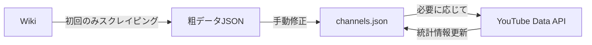
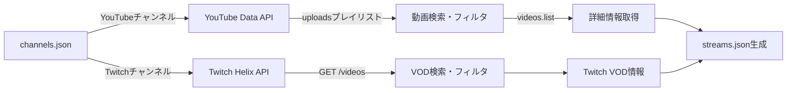

# VCRGTA 配信タイムテーブル - 仕様書

## プロジェクト概要

VCRGTA企画に参加する200名規模の配信者の配信・アーカイブを、時間軸で統一的に閲覧できるWebサイト。
ABEMA TVの番組表のようなUIで、複数視点から同時刻の配信を比較・視聴できる。

## UI/UX仕様

### レイアウト

```
       チャンネル1  チャンネル2  チャンネル3  チャンネル4 ...
       ┌──────────┬──────────┬──────────┬──────────┐
0:00 ─ │          │ [配信A]  │          │          │
1:00 ─ │          │          │          │ [配信B]  │
2:00 ─ │ [配信C]  │          │          │          │
3:00 ─ │          │          │ [配信D]  │          │
4:00 ─ │          │          │          │          │
...    │          │          │          │          │
12:00─ │          │          │          │          │
       └──────────┴──────────┴──────────┴──────────┘
       ←────── 横スクロール（仮想スクロール）──────→
```

### 軸構成

- **縦軸（Y軸）**: 時間（上から下へ時間が流れる）
  - デフォルト表示範囲：12時間
  - グリッド線：1時間ごと
  - 時刻ラベル：1時間ごとに表示（左端固定）

- **横軸（X軸）**: チャンネル（左から右へチャンネルが並ぶ）
  - 表示件数：100-200チャンネル
  - 仮想スクロール：パフォーマンス最適化のため
  - チャンネルヘッダー：上部固定
  - 並び順：再生回数順（降順）

### 配信カード

- **表示情報**:
  - タイトル
  - サムネイル画像
  - 開始時刻・終了時刻（または配信時間）

- **インタラクション**:
  - クリック：YouTube動画ページを別タブで開く
  - ホバー：詳細情報をツールチップ表示（オプション）

### スクロール動作

- **縦スクロール**: 時間軸を移動（全期間閲覧可能）
- **横スクロール**: チャンネル軸を移動（仮想スクロール）
- ヘッダー（時刻ラベル・チャンネル名）は固定

## データ構造

### チャンネルマスター（`data/channels.json`）

```typescript
{
  channels: Array<{
    id: string; // 内部ID（UUID）
    name: string; // チャンネル名
    // YouTube（オプショナル）
    youtubeChannelId?: string; // YouTubeチャンネルID
    youtubeHandle?: string; // YouTube @ハンドル
    // Twitch（オプショナル）
    twitchUserId?: string; // Twitchユーザーカードー
    twitchUserName?: string; // Twitchユーザー名
    // 共通
    avatarUrl: string; // アイコン画像URL
    job?: string; // 職業（Wikiから取得、グループ分けに使用）
    totalViews?: number; // 総再生回数（並び順に使用）
  }>;
}
```

### 配信データ（`data/streams.json`）

```typescript
{
  period: {
    start: string;                 // 企画開始日時（ISO 8601形式）
    end: string;                   // 企画終了日時（ISO 8601形式）
  },
  streams: Array<{
    id: string;                    // 内部ID（UUID）
    channelId: string;             // チャンネルID（channels.jsonと紐付け）
    platform: 'youtube' | 'twitch'; // プラットフォーム識別子
    videoId: string;               // 動画ID（YouTubeまたはTwitch）
    title: string;                 // 配信タイトル
    thumbnailUrl: string;          // サムネイル画像URL
    startTime: string;             // 配信開始日時（ISO 8601形式）
    endTime?: string;              // 配信終了日時（ISO 8601形式、配信中はnull）
    scheduledStartTime?: string;   // 配信予定時刻（予定配信の場合）
    duration?: number;             // 配信時間（秒、endTime - startTimeで計算）
    isLive: boolean;               // 現在ライブ配信中かどうか
    viewCount?: number;            // 再生回数
  }>
}
```

**注意**:

- **YouTube**: `startTime`と`endTime`は`liveStreamingDetails.actualStartTime`と`actualEndTime`から取得します。通常のアップロード動画（`liveStreamingDetails`が存在しない）は除外されます。
- **Twitch**: VOD（Video on Demand）の`created_at`を`startTime`とし、`duration`から`endTime`を計算します。

### 企画期間設定（`data/config.json`）

```typescript
{
  event: {
    name: string;                  // 企画名（例: "VCRGTA"）
    startDate: string;             // 企画開始日（ISO 8601形式）
    endDate: string;               // 企画終了日（ISO 8601形式）
  },
  filters: {
    titleKeywords: string[];       // タイトルフィルタキーワード（例: ["GTA", "MADTOWN"]）
  },
  display: {
    defaultTimeRange: number;      // デフォルト表示時間（時間単位、デフォルト12）
    timeGridInterval: number;      // 時間グリッド間隔（時間単位、デフォルト1）
  }
}
```

## データ取得フロー

### 1. チャンネル情報取得

**データ管理方針**: 手動管理（初回作成時のみスクレイピング補助ツールを使用）



**初回データ作成フロー**:

1. **Wikiスクレイピング（補助ツール）**
   - データソース: https://w.atwiki.jp/madtowngta1/pages/12.html
   - 取得情報: チャンネル名、YouTubeチャンネルID、Twitchユーザー名、職業
   - 出力: 粗データJSON（手動修正が必要な状態）

2. **手動修正**
   - スクレイピング結果を確認・修正
   - フォーマット整形、誤りの修正
   - `data/channels.json`として保存

3. **YouTube Data API（オプション）**
   - `channels.list`エンドポイント
   - `@handle`をチャンネルIDに変換（`forHandle`パラメータ使用）
   - アイコンURL、統計情報（総再生回数）を取得

4. **Twitch API（ID解決）**
   - Twitchユーザー名をユーザーIDに変換
   - `GET /helix/users?login={username}`エンドポイント使用
   - OAuth2 Client Credentials Flowで認証

**運用時の更新**:

- チャンネルの追加・削除：手動で`channels.json`を編集
- 統計情報の更新：必要に応じてYouTube APIで更新スクリプト実行

### 2. 配信データ取得



**YouTube Data API使用**:

1. `channels.list` エンドポイント（uploadsプレイリストID取得）
   - チャンネルの`contentDetails.relatedPlaylists.uploads`を取得

2. `playlistItems.list` エンドポイント
   - uploadsプレイリストから動画を取得（新しい順）
   - 期間フィルタ: `publishedAfter`/`publishedBefore`で絞り込み
   - タイトルフィルタ: キーワード（"GTA", "MADTOWN"等）でフィルタ

3. `videos.list` エンドポイント（`part=liveStreamingDetails,snippet,statistics`）
   - 動画詳細取得（タイトル、サムネイル、統計等）
   - **ライブ配信判定**: `liveStreamingDetails`の存在確認
   - **通常アップロード動画は除外**（切り抜き・まとめ動画等を対象外にするため）

**Twitch Helix API使用**:

1. OAuth2認証（Client Credentials Flow）
   - `POST /oauth2/token`でアクセストークン取得
   - `client_id`、`client_secret`、`grant_type=client_credentials`

2. `GET /helix/videos` エンドポイント
   - `user_id`パラメータでユーザーのVODを取得
   - 期間フィルタ: `created_at`で絞り込み
   - タイトルフィルタ: キーワードでフィルタ
   - `duration`からendTimeを計算

### 3. ライブ配信の時刻取得

YouTube Data API v3の`videos.list`で`part=liveStreamingDetails`を指定すると、ライブ配信動画（予定／配信中／アーカイブ）にのみ`liveStreamingDetails`フィールドが返されます。

**取得可能な情報**:

```json
{
  "liveStreamingDetails": {
    "scheduledStartTime": "2025-10-01T10:00:00Z", // 配信予定時刻
    "actualStartTime": "2025-10-01T10:05:23Z", // 実際の配信開始時刻
    "actualEndTime": "2025-10-01T11:32:10Z" // 実際の配信終了時刻
  }
}
```

**使用する時刻**:

- `actualStartTime`: 実際の配信開始時刻（配信開始後に値が埋まる、アーカイブ化後も保持）
- `actualEndTime`: 実際の配信終了時刻（配信終了後に値が埋まる）

**フィルタリング**:

- `liveStreamingDetails`が存在しない動画 → 除外（通常アップロード動画）
- `actualStartTime`が存在しない動画 → 除外または予定配信として扱う

**参考**: [YouTube Data API - Videos](https://developers.google.com/youtube/v3/docs/videos)

## 技術スタック

### フロントエンド

- **フレームワーク**: Next.js 15 (App Router)
- **言語**: TypeScript
- **スタイリング**: Tailwind CSS
- **仮想スクロール**: @tanstack/react-virtual
- **日時処理**: date-fns
- **状態管理**: React hooks

### データ取得（管理者用スクリプト）

- **実行環境**: Node.js
- **Webスクレイピング**: cheerio（Wikiからチャンネルリスト取得）
- **API**:
  - YouTube Data API v3（公式クライアントライブラリ使用）
  - Twitch Helix API（OAuth2 Client Credentials Flow）
- **HTTP**: axios

### デプロイ・CI/CD

- **ホスティング**: Vercel
- **デプロイ方式**: 静的エクスポート（SSG）
- **自動化**: GitHub Actions
  - 定期実行（cron）でデータ更新
  - データ更新後、自動ビルド・デプロイ

## 機能要件

### 1. タイムテーブル表示（コア機能）

- [x] 縦軸：時間、横軸：チャンネルのグリッド表示
- [x] 配信カードを時間・チャンネルに応じて配置
- [x] 時刻ラベル・チャンネルヘッダーの固定
- [x] 縦・横スクロール対応
- [x] 仮想スクロール（横軸チャンネル）

### 2. 配信カード表示

- [x] サムネイル画像
- [x] タイトル
- [x] 開始時刻・終了時刻（または配信時間）
- [x] クリックで別タブで動画ページを開く（YouTube/Twitch対応）
- [x] プラットフォーム別色分け
  - YouTube: 青色（`bg-blue-500`）
  - Twitch: 紫色（`bg-purple-600`）
- [x] ライブ配信中の表示（"LIVE"バッジ）
- [ ] ホバー時のツールチップ表示（オプション）

### 3. フィルタ・検索機能

- [x] チャンネル名検索（リアルタイムフィルタ）
- [x] 職業グループ絞り込み
- [ ] 日時範囲選択（特定日のみ表示）
- [ ] 配信中のみ表示フィルタ

### 4. ナビゲーション

- [x] 日付ピッカー（特定日時にジャンプ）
- [ ] 「現在時刻に移動」ボタン
- [ ] 時間範囲調整（6時間/12時間/24時間表示切替）

### 5. レスポンシブ対応

- [x] デスクトップ表示最適化（メイン）
- [ ] タブレット対応
- [ ] モバイル対応（簡易リスト表示）

### 6. パフォーマンス最適化

- [x] 仮想スクロール（@tanstack/react-virtual）
- [x] 画像遅延読み込み（Lazy loading）
- [x] 静的生成（SSG）
- [ ] データのチャンク分割（日付ごとにJSON分割）

## 非機能要件

### パフォーマンス

- 初期ロード時間: 3秒以内（3G回線）
- スクロール時のFPS: 60fps維持
- 対応チャンネル数: 200件以上
- 対応配信数: 10,000件以上

### YouTube API Quota管理

- 1日あたりのquota上限: 10,000ユニット
- 主な消費:
  - `search.list`: 100ユニット/リクエスト
  - `channels.list`: 1ユニット/リクエスト
  - `videos.list`: 1ユニット/リクエスト

- 200チャンネル × 100ユニット = 20,000ユニット（1日で完了不可）
- **対策**:
  - 差分更新（前回取得済みのデータはスキップ）
  - バッチ処理（50チャンネルずつ取得）
  - キャッシュ（チャンネル情報は1週間キャッシュ）

### ブラウザ対応

- Chrome: 最新版
- Firefox: 最新版
- Safari: 最新版
- Edge: 最新版

## データ更新戦略

### GitHub Actionsによる自動更新

```yaml
# .github/workflows/update-data.yml
name: Update Stream Data

on:
  schedule:
    - cron: "0 */6 * * *" # 6時間ごと実行
  workflow_dispatch: # 手動実行も可能

jobs:
  update:
    runs-on: ubuntu-latest
    steps:
      - Checkout
      - Setup Node.js
      - Install dependencies
      - Run data fetch script
      - Commit & Push changes
      - Trigger Vercel deployment
```

### 更新頻度

- **チャンネルリスト**: 手動管理（`data/channels.json`を直接編集）
- **配信データ**: 6時間ごと（GitHub Actions自動実行）
- **緊急更新**: 手動実行可能（GitHub Actionsのworkflow_dispatch）

### データ永続化

- すべてのデータはGitリポジトリで管理
- JSON形式でバージョン管理
- 過去データも保持（履歴追跡可能）

## セキュリティ

- YouTube API Keyは環境変数で管理（GitHub Secrets）
- APIキーはクライアント側に公開しない
- RateLimiting対策（API呼び出し間隔制御）

## 今後の拡張可能性

- [x] Twitch対応（完了）
- [ ] 複数企画対応（VCRGTA、VCRARKなど）
- [ ] ユーザー設定保存（お気に入りチャンネル等）
- [ ] 同時視聴機能（複数配信を同時埋め込み）
- [ ] コメント表示連携

## 参考リンク

- VCRGTA Wiki: https://w.atwiki.jp/madtowngta1/
- YouTube Data API: https://developers.google.com/youtube/v3
- ABEMA タイムテーブル: https://abema.tv/timetable
